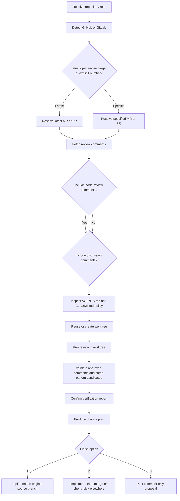

# Review PR

`review-pr` reviews the latest open GitHub pull request or GitLab merge request through a local worktree, gathers remote feedback, validates which comments still matter, and then either implements fixes locally or posts a concrete proposal back to the remote.

## What It Does

- resolves the latest open MR/PR, or a user-specified MR/PR number
- fetches MR/PR review feedback and splits it into `code-review comments` and `discussion comments`
- detects GitHub vs GitLab from the repo remote
- inspects `AGENTS.md` and `CLAUDE.md` before any worktree action
- reuses or creates the correct local worktree for the MR/PR source branch
- syncs the worktree to the remote branch head
- supports a review flow that ends with a change plan and explicit finish options
- can post proposed changes back as a GitLab or GitHub comment instead of implementing locally

## Prerequisites

- `git`
- `jq`
- `gh` for GitHub repositories
- `glab` for GitLab repositories

## Install

Primary install:

```bash
npx skills add minakoto00/vcs-review-flow --skill review-pr
```

Optional shortcut:

```bash
npx @minakoto00/skills install review-pr
```

## How It Works

From a repository you want to review, the core steps are:

1. Detect the platform.
2. Resolve the latest open MR/PR or a specific one.
3. Fetch comment summaries for the MR/PR.
4. Inspect repo policy from `AGENTS.md` and `CLAUDE.md`.
5. Ask the user whether to include code-review comments in scope.
6. Ask the user whether to include discussion comments in scope.
7. Reuse or create the source-branch worktree.
8. Run review in that worktree.
9. Produce a change plan.
10. Choose whether to implement locally or post the proposal remotely.

If comments are present:
- ask the user whether to include code-review comments in scope
- ask the user whether to include discussion comments in scope
- only the approved comment categories move forward
- resolved code-review feedback is excluded by default
- outdated threads are validated separately from unresolved threads
- group approved unresolved and outdated code-review feedback into issue clusters before validation
- dispatch several subagents in parallel when approved comments need validation
- search only within changed files for same-pattern candidates
- report same-pattern candidates separately from the original issues
- show a verification report before planning fixes
- if the user confirms, keep the confirmed issues in scope even when tests do not yet cover them

## Flowchart



## Local Development

When running the skill directly from a clone of this repository, use the scripts under `skills/review-pr/`.

Detect platform:

```bash
bash ./skills/review-pr/scripts/detect_platform.sh --repo /path/to/repo
```

Resolve the latest open MR/PR:

```bash
bash ./skills/review-pr/scripts/resolve_review_target.sh \
  --repo /path/to/repo \
  --latest
```

Resolve a specific MR/PR number:

```bash
bash ./skills/review-pr/scripts/resolve_review_target.sh \
  --repo /path/to/repo \
  --number 123
```

Inspect repo worktree policy:

```bash
bash ./skills/review-pr/scripts/repo_policy.sh \
  --repo /path/to/repo
```

Fetch review comments:

```bash
bash ./skills/review-pr/scripts/fetch_review_comments.sh \
  --repo /path/to/repo \
  --number 123 \
  --platform github \
  --json
```

Prepare or reuse the worktree:

```bash
bash ./skills/review-pr/scripts/worktree_sync.sh \
  --repo /path/to/repo \
  --source-branch feat/example \
  --head-sha abcdef1234567890
```

Post a comment-only proposal:

```bash
bash ./skills/review-pr/scripts/post_review_comment.sh \
  --repo /path/to/repo \
  --number 123 \
  --body-file /tmp/review-plan.md
```

## Safety Rules

- The skill reads both `AGENTS.md` and `CLAUDE.md` when present.
- If those files conflict on worktree policy, it stops instead of guessing.
- If an existing worktree is dirty, it stops before syncing.
- It does not force-push unless the user explicitly asks.
- It requires `gh` or `glab` authentication for live remote operations.

## Related Files

- `skills/review-pr/SKILL.md`: skill entrypoint and workflow contract
- `skills/review-pr/scripts/`: runtime helpers for platform detection, target resolution, policy parsing, worktree sync, and comment posting
- `skills/review-pr/docs/examples.md`: extra examples
